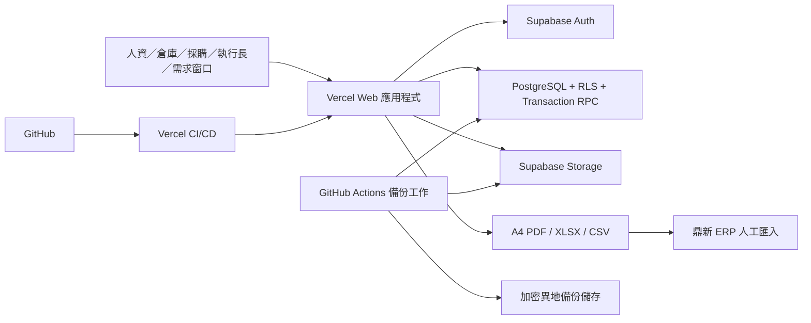

# 系統架構

- 狀態：建議基準
- 相關規格：[產品需求](../spec/product-requirements.md)｜[資料模型](../spec/data-model.md)｜[免費方案查核](../research/free-tier-constraints.md)｜[資料保存與容量](./data-retention.md)

## 1. 架構目標

1. 庫存正確性由 PostgreSQL 交易保障，不依賴前端欄位限制。
2. 使用 Vercel 與 Supabase 免費方案完成第一版，同時保留清楚的配額與升級門檻。
3. 個人帳號、角色、機構＋部門範圍在資料庫層強制執行。
4. 主檔、單據、流水、稽核及 ERP 批次均可追溯且不被無痕覆寫。
5. 第一版只支援線上作業，避免離線同步造成重複扣庫。
6. 長時間工作可中斷、續跑及安全重試，不以單一 HTTP 請求或瀏覽器記憶體作為完成保證。
7. 正式資料與檔案具備可執行的異地備份、從零還原流程及量化的 RPO／RTO。
8. 三年容量投影必須在免費配額安全水位內；無法通過時先調整保存策略或升級，不帶風險上線。

## 2. 建議技術組合

| 層次 | 建議 |
|---|---|
| 原始碼 | GitHub 個人帳號持有的私有儲存庫、Pull Request；repository owner 必須是連接 Vercel Hobby 的帳號。所有 push collaborator 都視為 production 特權維運者；若不能授予此信任，不加 collaborator，改以加密 offsite `git bundle`、MFA recovery codes 與帳號移交程序備援。免費方案未提供所需強制規則時，以人工複核清單補足 |
| Web | Next.js＋TypeScript，部署至 Vercel |
| UI | 響應式繁體中文介面，以桌面／平板作業為主 |
| 身分驗證 | Supabase Auth，僅邀請制個人帳號 |
| 資料庫 | Supabase PostgreSQL，migration 版控 |
| 檔案 | Supabase Storage 私有 bucket 存放匯入原檔、錯誤報告及正式成品；物件使用不可覆寫的隨機 key，依保存政策清理可重建暫存檔 |
| PDF | 從鎖定 snapshot 以可重試工作產生 A4 PDF；正式 artifact 版本化、保存 SHA-256，不覆寫舊版 |
| Excel | XLSX／CSV 範本、瀏覽器直傳 Storage、可續跑分塊解析、整批原子發布 |
| ERP | 版本化鼎新檔案轉接器；第一版單向匯出 |

框架與 UI 函式庫可在實作啟動時調整，但 PostgreSQL 作為庫存真相來源、Supabase Auth／RLS 及 Vercel 部署邊界不變。

## 3. 系統關係



## 4. 應用模組

```text
帳號與權限
├─ 個人帳號、角色、機構＋部門範圍
主檔
├─ 機構、部門、員工、制服、供應商、倉庫
日常作業
├─ 人資需求、發放明細、增庫、補庫、倉庫發貨
換季與採購
├─ 活動、窗口需求、人資修正、CEO 核准、MOQ、採購、入庫
庫存控制
├─ 庫存流水、餘額、預留、盤點、更正、退回
文件與整合
├─ PDF、Excel 匯入匯出、鼎新批次、稽核與報表
耐久工作
└─ 分塊處理、租約、重試、失敗復原、孤兒檔清理
```

## 5. 庫存一致性設計

### 5.1 真相來源

- `inventory_ledger_entries` 是每筆庫存增減的不可變來源。
- `inventory_balances` 是逐「倉庫＋制服品號」維護的即時餘額，可由流水重建及核對。
- `inventory_reservations` 保存尚未發貨需求占用的合計數量。
- 前端顯示的最大輸入值只是輔助；送出及發貨必須由資料庫函式重新檢查。

### 5.2 原子操作

至少以 PostgreSQL 函式或單一伺服器交易提供：

- `submit_hr_demand`：檢查主檔、逐品號鎖定餘額、檢查可申請量、建立預留。
- `amend_hr_demand_before_shipment`：重算差額與預留，保存異動紀錄。
- `cancel_hr_demand`：只允許倉庫 `POST` 前的誤建／重複單，釋放預留並保留取消原因。流程規定 `POST` 前不得交付；若發生例外的提前交付，須以更正／退回追蹤，不能用取消掩蓋實物異動。
- `ship_hr_demand`：驗證角色與單據狀態，寫入總倉調出、人資倉調入、人資發放扣除、釋放預留、鎖單及稽核。
- `post_purchase_receipt`：檢查採購未到量與超收，增加總倉。
- `post_stocktake`：以帳面與實盤差額建立調整流水。
- `post_correction_or_return`：關聯原單，以新流水處理差額。
- `publish_opening_balance`：鎖定全系統 `system_cutover_state` singleton，只允許 PRE_CUTOVER 的唯一批次把期初 posting、餘額及 LIVE 切換同交易完成；所有一般庫存過帳只在 LIVE 後開放。
- `create_erp_export_batch`：鎖定符合資格且未匯出的來源明細，建立不可變批次。

交易必須具備：

- 對相關餘額及來源列加鎖。
- 所有庫存命令採同一順序：先 claim 冪等命令，再依品號鎖共同互斥列，接著鎖來源／業務根列、排序後餘額，最後鎖排序後預留；任何模組不得自行顛倒。
- `CHECK quantity >= 0` 與不得產生負餘額的防線。
- 唯一的重複請求鍵，避免使用者連按或網路重送。
- 失敗時整筆回滾，不留下半套流水或預留。

### 5.3 命令結果與斷線協調

所有會改變正式資料的命令共用同一個小型介面：

1. 瀏覽器在第一次送出前產生 `idempotency_key`，重試時沿用，不得每次重建。
2. 短交易先建立 command claim，保存 key、命令種類、canonical 參數雜湊、操作者、`IN_PROGRESS`、lease／fencing generation；同 key 搭配不同參數必須拒絕。
3. 同一 key 再次呼叫時，若先前已完成即回傳原結果；若 lease 尚有效則回傳目前狀態，不重新過帳；lease 逾期只能由 reconcile 取得下一 generation 後接手。
4. 網路中斷或逾時只代表「結果未知」，畫面顯示 `UNKNOWN_RESULT`，不可直接宣告失敗或未完成。
5. 恢復連線後先以 key 查詢命令結果；查不到才由使用者確認重送。任何重送仍受資料庫唯一鍵與交易保護。

command claim 可先提交，以便其他請求看到 `IN_PROGRESS`；但純資料庫命令的業務寫入、成功結果 id 與 claim 的 `SUCCEEDED` 必須在**同一 PostgreSQL transaction**完成，並再次比對 lease／generation。如此 response 遺失時可查回，transaction rollback 時也不會留下假的成功；只會留下可安全接手的逾期 claim。需要 Storage 等外部副作用的命令不得偽裝成單一交易：命令在 PREPARING batch／artifact 與 attempt 已耐久建立時設 SUCCEEDED，後續改走第 7／8 節的 durable job state machine，不持續占用原 command lease。逾時後的 reconcile 只依 command key、正式來源唯一鍵與 artifact/job 狀態判定，不以瀏覽器記憶或「再扣一次試看看」判定。

這個命令介面隱藏各單據的鎖定、重驗、流水與稽核實作，並作為整合測試的主要 seam。

## 6. 權限與資料安全

### 6.1 身分與角色

- 關閉公開註冊，由系統管理員邀請帳號。
- 一個帳號可掛多個業務角色。
- 需求窗口另掛多組機構＋部門範圍。
- 禁止前端持有 Supabase `service_role` 金鑰。

### 6.2 RLS 原則

- 對 PostgREST 暴露的業務資料表全部啟用 RLS；`anon` 不取得任何業務 table、view、function 或 Storage object 的權限。
- 主檔查詢依角色開放；停用與刪除分權。
- 需求窗口只能讀寫其範圍內、仍在開放期的換季資料。
- 人資可管理員工、需求與人資倉，但不能替倉庫填實際調庫量。
- 倉庫可處理總倉及發貨，但不能改發放量與增庫量。
- 採購可管理 MOQ、採購與價格，不可核准換季需求。
- 執行長只處理核准及查閱必要彙總。
- 系統管理員不因技術角色自動取得業務發貨或核准權。
- 高風險寫入除 RLS 外，仍由受控資料庫函式驗證角色與狀態。
- 撤銷一般登入角色對流水、餘額、預留、稽核、正式快照、已套用匯入與 ERP 批次的直接寫入權限；只能透過受控命令介面操作。
- RLS helper 與具權限的實作函式放在不對 PostgREST 暴露的 `private` schema；對外只暴露少量薄 RPC。view 使用 `security_invoker = true`，否則放在 private schema 後由受控函式讀取。
- migration 必須先 `REVOKE EXECUTE ON FUNCTION ... FROM PUBLIC, anon`，再逐一授權必要 RPC 給 `authenticated`；同時設定 default privileges，避免新函式意外公開。
- `SECURITY DEFINER` 函式由專用、不可登入且最小權限的 owner 持有，固定安全 `search_path`，所有物件使用 schema-qualified 名稱，不接受前端傳入 actor，也不使用未經 allowlist 的動態 SQL。
- 使用者觸發的 RPC 使用該使用者 JWT，函式內顯式驗證 `auth.uid() IS NOT NULL`，再由目前 Auth UUID 找到唯一且啟用的 `app_accounts`，並檢查業務角色、資料範圍與狀態。`service_role` 不代替使用者執行一般畫面命令。
- Supabase `service_role` 是可繞過 RLS 的 project-wide 高權限 secret，不能宣稱為最小權限。資料庫背景工作優先使用各自的專用 login role／薄函式 grant；只有 Auth 邀請／停用、Storage 全量備份／還原／受控孤兒清理等管理 API 確實需要時才使用 `service_role`。這些入口限於 server-side 固定 workflow：互動入口先用呼叫者 JWT 驗證系統管理員權限，非互動入口驗證固定 job identity；參數採 allowlist、分環境保存 secret 並留下 job audit。

### 6.3 個資與檔案

- 不蒐集制服作業不需要的敏感個資。
- 真實資料、Excel、PDF、鼎新檔及金鑰不得提交 GitHub。
- 匯出與大量下載留下稽核紀錄。
- 匯入原檔、正式 PDF、ERP 檔及暫存檔使用不同 private bucket，分別設定 MIME、大小、路徑與操作 policy；任何 bucket 都不使用公開 URL。
- 上傳前先由後端建立不可猜測的 batch／artifact key；瀏覽器只能直傳到該 key，不允許 `upsert`、覆寫、任意列舉或刪除其他物件。
- 下載含員工資料的檔案優先使用帶使用者 JWT 的 authenticated Storage URL，讓每次請求重新套用 RLS。
- 只有無法使用 authenticated download 時才產生 signed URL；產生前重新驗證角色與來源單據，TTL 固定為 60 至 120 秒。簽名 URL 在到期前不能因停用帳號而立即撤銷，因此不得使用長效連結。
- 正式物件使用版本化 key，metadata 保存大小、MIME、SHA-256、來源批次及產生者；使用者角色無 UPDATE／DELETE 權限。

## 7. 匯入與長時間作業

### 7.1 第一版耐久批次介面

第一版不增加外部佇列。匯入與大型匯出採「使用者驅動、資料庫保存進度」：

1. `start_batch` 先以冪等命令建立 `AWAITING_UPLOAD` batch、隨機且不可覆寫的 Storage key、預期 MIME／大小與 upload expiry；此時不建立可執行的 parse job。
2. 瀏覽器只能直接上傳到該 private Storage key，不讓檔案經過 Vercel Function request body；回應遺失時查回同一 batch／key，不另配新 key。
3. `confirm_upload` 由後端核對固定 key 的 MIME、實際大小、SHA-256 與完成 metadata，吻合後才原子轉 `UPLOADED` 並建立第一批固定列範圍 parse chunks；逾期未確認批次可取消，孤兒 bytes 只在無引用檢查後清理。
4. 受控 import worker 透過 `list_import_work` 取得待處理 batch，再以 `claim_import_chunk` 一次租用一個固定範圍的 PARSE／VALIDATE chunk；job 保存 `processing_cursor`、`lease_token`、`lease_expires_at`、`lease_generation`、`attempt_count`、`next_retry_at` 與 `last_error`。
5. worker 取得短租約後才能處理；每次接手都遞增 `lease_generation` 作為 fencing token。chunk 寫回交易必須同時比對 `lease_token`、generation、未逾期 `lease_expires_at` 與預期 cursor，否則舊 worker 即使稍後恢復也不得提交。租約逾時可由同一使用者按「繼續」或由後續請求接手；每個 chunk 以唯一鍵及受 fencing 保護的 upsert 保證重跑不重複。
6. UI 只負責查詢 durable batch 狀態與呈現確認流程，不直接呼叫 worker RPC。`npm run import:worker` 預設依 `IMPORT_POLL_MS` 持續輪詢並接續可執行的 PARSE／VALIDATE／APPLY；`--once` 僅供單輪 claim／smoke。關閉頁面不會停止已部署的常駐 worker，也不會丟失進度；重新開啟可從 durable batch／cursor 查回目前狀態。實際 staging 是否已有常駐 worker 仍必須以部署 smoke 驗證，不能由版本庫存在 runner 即推定完成。
7. Vercel Hobby Cron 只每日執行一次逾期租約復原與未引用暫存物件清理；不解析 chunk、不產生正式檔案，也不負責保證一般批次即時完成。
8. 解析與驗證可分塊，但正式發布使用單一、可回滾的 set-based PostgreSQL 交易；任一錯誤都阻擋整批套用。

只有暫時性錯誤可進入 `RETRY_WAIT` 並依 `next_retry_at` 指數退避，第一版每個 chunk 最多自動嘗試 5 次；格式／業務驗證錯誤直接成為可下載結果，不自動重試。達上限後進入 `FAILED` 等待人工作業；受控重新啟動會留下稽核、建立新的 fencing generation 並沿用同 batch、cursor 與唯一 row key，不另建重複正式資料。

### 7.2 檔案防護與驗證

- 第一版只接受 `.xlsx` 與 `.csv`；拒絕 `.xls`、`.xlsm`、`.xlsb`、巨集、OLE 物件、外部 workbook relationship 及遠端資料連線。
- 正式 parser 的預設上限為單檔 10,000,000 bytes、每 workbook 20 個 sheet、合計最多 10,000 列、每列最多 50 欄、全檔最多 500,000 個儲存格、單格最多 1,000,000 字元。worker 跨 sheet flatten 同樣限制總資料列不超過約 10,000；取得真實樣本與容量測試結果後才能調整這些值。
- XLSX 解壓前先檢查 ZIP entry 數、宣告大小、路徑穿越與壓縮比；正式 parser 預設最多 200 個 entry、累計解壓 50,000,000 bytes、壓縮比 100:1。超限整批拒絕，不嘗試部分解析；任何調高仍不得突破部署與 Supabase 方案的實際限制。
- 不能只信 ZIP header 宣告值；解壓採串流 byte counter，任何 entry 或累計實際輸出到達上限就中止。XML parser 禁用 DTD、外部 entity、網路與本機檔案 resolver，出現 `DOCTYPE` 即拒絕。
- 匯入程式不執行公式，也不採信 formula cached result；被映射欄位出現公式時列為錯誤。工號、品號與所有代碼一律按文字處理，保留前導零。
- 瀏覽器檢查只改善體驗；後端重新檢查檔案類型、結構與每列業務規則，資料庫再驗證唯一鍵、外鍵及正式不變條件。
- CSV／XLSX 錯誤報告與一般匯出對以 `=`, `+`, `-`, `@` 開頭的文字做試算表公式注入防護。
- 每列錯誤可下載；修正後建立新批次，不直接改已發布批次。未引用上傳、解析暫存與錯誤報告依[資料保存與容量](./data-retention.md)清理。

## 8. 列印與匯出

### 8.1 PDF artifact 生命週期

- 正式 PDF 只讀取鎖定 snapshot；草稿使用即時資料、加浮水印且原則上不持久保存。
- 文件模組只暴露 `request_document`、`get_document_status` 與 `download_document` 三個介面，將版面、字型、Storage 及重試細節留在實作內。
- artifact revision 狀態為 `PREPARING → READY` 或 `FAILED`；其 render attempt/job 狀態另為 `PENDING → RENDERING → SUCCEEDED` 或 `FAILED`。artifact 明確保存 `source_snapshot_version` 與 `source_snapshot_hash`；FORMAL 從 PREPARING 起必填。冪等 fingerprint 至少包含單據種類、單據 id、artifact kind、來源版本／hash 與 template version，不能把摘要當成來源欄位，也不能把 job 狀態與可下載 artifact 狀態混用。
- renderer 在資料庫交易外從固定 snapshot 產生檔案，嵌入專案版本化的繁中文字型，不依賴 Vercel runtime 系統字型；上傳後計算 SHA-256，再以短交易登記 artifact。
- 每個 document type＋document id＋artifact kind 先建立文件家族鎖定根，保存 `active_artifact_id`／`current_artifact_id`；request transaction 鎖定家族並重驗沒有 active 或其他 PREPARING revision，才建立 artifact 與 `PENDING` attempt。資料庫以 partial unique constraint 保證每個家族最多一個 PREPARING artifact，避免不同冪等鍵同時啟動兩個 revision。
- 每次 render attempt 另配不可覆寫 object key。renderer 若發現該 attempt object 已存在，只能在 hash 相符時接續 finalize，不得 upsert 或另選即時資料；hash 不符則封鎖該 attempt，改以同 snapshot 的新 attempt key 重試。finalize／terminal-fail transaction 共鎖家族、artifact 與 attempt，只有仍被家族 active pointer 指向且 fencing 有效的 artifact 可以完成並清空 active；較舊 revision 或競爭輸家不得取代較新的 current，其餘未引用物件才可清理。
- 同一工作重試只補完同一 artifact；模板變更需建立新 artifact，以 `supersedes_artifact_id` 串接並標示目前正式版。任何既有正式檔與 hash 不覆寫。
- PDF 與 Excel 產生器使用相同查詢模型，避免畫面、列印與匯出數量不同；大型檔寫入 Storage 後下載，不把 Vercel Function 當檔案伺服器。

### 8.2 鼎新 ERP 快照與檔案

ERP 匯出使用兩階段、可重試的深模組，避免 Storage 與 PostgreSQL 無法共用 ACID transaction 所造成的競爭：

1. **Snapshot transaction：**`create_erp_export_batch` 依固定順序鎖定候選來源列，重新確認已發貨且未被占用；建立批次編號與 `PREPARING` logical batch，寫入不可變的日期＋機構分組、品號彙總及全部 source links／source snapshot hash 後，把 batch command 設 `SUCCEEDED` 並 commit。此步不選格式、不建立 artifact；source link 唯一鍵已阻擋另一批次取用同一來源。
2. **Artifact request transaction：**`request_erp_artifact` 使用獨立冪等鍵，鎖定既有 batch，重驗 `active_artifact_id` 為空且不存在其他 PREPARING artifact，才選定版本化格式、建立 `PREPARING` artifact revision、fingerprint 及第一個 `PENDING` attempt並設定 active pointer；partial unique constraint 另保證每個 batch 最多一個 PREPARING revision。revision request command 同交易設 `SUCCEEDED`；命令成功只代表耐久工作已建立，不代表檔案 READY。
3. **Render/upload：**renderer 只讀取該批次 snapshot 與 artifact 格式版本，不再查詢即時候選 view；產生 payload、上傳 attempt 專屬且不可覆寫的隨機 key，保存內容大小與 SHA-256。
4. **Ready transaction：**鎖定同一 batch、artifact 與 attempt，先驗證 batch 的 `active_artifact_id` 仍指向本 artifact，再核對同父關係、fencing lease、snapshot、物件 key、格式版本與 hash；合法 winner 才把 artifact 設 `READY`、批次轉 `GENERATED`、設定 current 並清空 active pointer。此步不修改前兩個已 SUCCEEDED commands；只有此後才能下載。舊 revision 或競爭輸家不得推進 batch。
5. 單次產生或上傳失敗先保存不可變 failed attempt，暫時性錯誤可在同一 `PREPARING` revision 建立新 attempt；達重試上限或確認不可重試後，terminal-fail 也必須鎖 batch 並驗證 active pointer，才把該 revision 設 `FAILED`、批次設 `GENERATION_FAILED` 並清空 active。受控重試讓同一邏輯批次回到 `PREPARING`、以第 2 步追加下一 revision，但必須從同一 snapshot 產生，不重新選候選來源。資料庫 finalize 失敗但物件已存在時，可用同一 attempt key／hash 冪等完成，不因未知結果先建立下一 revision。
6. 未被任何 batch／artifact 引用的暫存物件才可由每日清理工作刪除；已建立 source links 的失敗批次不得自動釋放來源，以免同一發放同時出現在兩個檔案。
7. 鼎新拒收但業務數量未變時，以第 2 步建立同一 logical batch 的新版 artifact，保留 `supersedes_artifact_id`；只有發放更正或退回才另建 adjustment batch。

取得鼎新成功樣本後，以獨立 adapter 實作欄位、編碼與檔名，不把固定規則散落在頁面。每個 adapter 版本以黃金檔驗證。

## 9. 環境與部署

```text
local       本機 Supabase／測試資料
preview     Vercel 預覽，連測試環境或唯讀假資料
production  正式 Vercel＋正式 Supabase
```

- 資料庫 schema 只透過 migration 變更。
- Vercel 與 Supabase 環境變數分環境管理。
- Pull Request 執行 lint、型別檢查、單元測試及資料庫測試。
- 免費部署基準是「個人 GitHub 帳號持有 private repository，且該帳號同時是 Vercel Hobby project owner」；Vercel owner 帳號啟用 MFA、離線保存 recovery codes、每日建立加密 offsite `git bundle` 並建立移交程序，不使用共用帳號，也不假設 Hobby 提供額外協作席位。
- personal private repository 的 push collaborator 能修改 Actions workflow，若 production branch 自動部署也等同能改 production 程式；因此只有被正式核准為 production 特權維運者的人才能加入。若業務不能接受此權限，第一版維持 owner 單獨 push，以 offsite source bundle 解決程式碼遺失，不以低估 collaborator 權限換取表面備援。
- 若 repository 已由 GitHub Organization 持有，Vercel Hobby 無法直接連接該 private repository；必須先改為上述個人持有方式，或升級部署方案。此項在第 0 階段驗證，不延後至上線。
- 若 GitHub Free 的私有儲存庫無法強制所需的 reviewer／branch rule，合併人須依版本化清單人工確認；不得以為規則已由平台強制。
- 預覽部署不得連正式資料庫進行寫入。
- migration 先在測試環境驗證，再於維護時段套用正式環境。

## 10. 備份、監控與免費方案

- 免費方案限制及查核日期見 [free-tier-constraints.md](../research/free-tier-constraints.md)。
- 詳細保存期間、封存與容量水位見[資料保存與容量](./data-retention.md)。

### 10.1 可執行備份

- 由 GitHub Actions 每 12 小時非整點排程執行，另提供 `workflow_dispatch` 手動重跑及 concurrency lock；保存政策每日只晉升一份成功快照為 daily generation。指定 owner 或代理每日檢查最後成功 manifest，超過 18 小時未成功即人工重跑，讓單次排程延誤仍有機會守住 24 小時 RPO。Vercel Cron 不執行資料庫 dump。
- 備份與還原不得只寫在操作手冊；第 0 階段必須在版本庫建立並由 CI 呼叫固定入口：`scripts/backup/export-db.sh`、`scripts/backup/export-auth.sh`、`scripts/backup/export-storage.mjs`、`scripts/restore/restore-from-zero.sh`、`scripts/restore/verify.sql`。腳本輸出工具版本、批次 id 與 manifest，但不得輸出 credential；任何步驟失敗即整體失敗且不得輪替舊備份。
- workflow 使用 pinned Supabase CLI／PostgreSQL client，透過官方支援的連線方式產生 roles、應用 schema 與 application data 邏輯備份；migration 仍以 GitHub 儲存庫為 schema source of truth。
- Supabase CLI 預設排除 `auth`、`storage` 等受管 schema，因此 `export-auth.sh` 必須使用已釘選的 PostgreSQL client 產生 Auth data-only dump，至少完整保存 `auth.users`、identities 與實際啟用的 MFA 關聯及逐表 row count，並維持原 UUID；不得把受管 Auth schema DDL 當成應用 migration。還原腳本只接受經演練確認相容的來源／目標 Auth schema 版本，版本或必要表不符即 fail closed。若此路徑無法安全匯出／還原 Auth，正式上線門檻視為未通過。
- Storage 另外以分頁方式列出所有 private bucket 物件，依 key、size、SHA-256 與 metadata 建立每日完整 manifest；物件 key 不可覆寫，因此工作可對照上次已驗證的 offsite manifest，只傳送新增且 offsite 尚不存在的 bytes。每月抽樣回讀，且 key／size／hash 任一不符即停止，不得把「同 key」直接當成內容相同。資料庫 dump 或 Storage metadata 不能代替物件備份。
- DB、Auth、Storage manifest、物件與部署設定清單先以 `age` 或同等工具加密，再上傳至 Supabase、GitHub Actions artifact 與 Vercel 之外的組織控管儲存。異地儲存可由 `rclone` adapter 連接組織既有 OneDrive 或其他核准目的地，但第 0 階段必須選定唯一正式 remote。
- 加密公鑰可供備份 job 使用；解密私鑰由兩位指定保管人離線保存，不放 GitHub、Vercel 或 Supabase。DB dump 子工作只持資料庫唯讀憑證；固定的 Auth／Storage export 子工作另在受保護 GitHub Actions environment 取得 Supabase `service_role`，只用於 Auth Admin 與 allowlist private buckets 的分頁 list／read。這是 project-wide 高權限例外，不得宣稱為最小權限，不得輸出或傳入瀏覽器；程式不接受任意 bucket／path，也不得 delete／upsert。異地目標憑證只具指定 prefix 的 append／list／read 權限。
- 異地備份 credential 只允許在指定 prefix 建立、列出與回讀，不允許覆寫或刪除；世代輪替由另一個受控 retention credential 執行，避免入侵備份工作後連舊備份一併刪除。
- 每次工作產生帶時間、工具版本、檔案清單、總大小與 SHA-256 的 manifest，使用 Actions secret 中的專用簽章金鑰簽名，驗證公鑰放版本庫；上傳後重新讀取並驗證。成功／失敗通知寄到共同維運信箱，且系統只保存不含秘密的最後成功時間與 manifest id。
- 保存 7 份每日、4 份每週、12 份每月備份；不得把 GitHub Actions artifact 或同一 Supabase project 當正式備份目的地。
- 以「最後一筆正式交易 commit 至最新已驗證 offsite manifest」量測 RPO；以「宣告災難且兩位保管人之一可提供金鑰，至新環境核對完成並可切換」量測 RTO。排程啟動或上傳開始都不算備份成功。
- 第 0 階段以三年投影資料連跑 30 天等價工作量：`壓縮 DB/Auth dump bytes × 每月執行次數 + 新增 Storage bytes + 還原演練下載 bytes`，再加 API／manifest overhead，必須低於 Supabase organization egress 的 60%，Actions 分鐘也低於 60%。若每 12 小時排程無法同時達此用量 gate 與 24 小時 RPO，只能調整經業務簽認的 RPO 或升級，不得停備 Storage、Auth 或降低驗證來勉強符合免費額度。

### 10.2 從零還原演練

至少每月執行一次，使用最新備份及全新 local 或隔離測試 project：

1. 建立相同區域與必要 extensions 的乾淨 Supabase project，先套用版本化 migration、RLS、函式、bucket 與 Auth 設定。
2. 優先還原 Auth 使用者、identity／MFA 關聯並保留原 UUID，再核對 `app_accounts.auth_user_id` 綁定；所有 created_by／posted_by 等業務外鍵本來就指向不可變的 `app_accounts.id`。若實際災難下 Auth UUID 無法安全原樣還原，只能依雙人核准程序重新邀請並受控 rebind，不得改寫歷史 actor 或猜測合併帳號。新 project 的舊 session 失效是預期結果，使用者需重新登入。
3. 在單一受控還原窗口匯入應用資料；重新建立必要索引、publication、排程及非資料庫設定，不在一般應用權限下執行。
4. 依 manifest 建立 private buckets、逐一還原 Storage objects，核對 key、大小與 SHA-256；不以直接寫 `storage.objects` metadata 取代物件 API。
5. 執行 ledger 對 balance、預留、採購未到量、ERP source link 唯一性及正式 artifact hash 的完整核對。
6. 以六種角色測試登入、RLS、RPC、authenticated download 與 signed URL；確認 Preview 仍無 production secret。
7. 演練環境只使用臨時 credentials，完成後撤銷，不修改 Vercel production environment。實際災難切換時才輪替新 project 的 database、service role、SMTP、cron 與異地上傳 credentials，更新 Vercel production environment，完成冒煙測試後切換流量。
8. 保存開始／結束時間、失敗點、人工步驟、資料差異及改善事項；沒有書面演練紀錄不算完成。

第一版暫定 **RPO 不超過 24 小時、RTO 不超過 8 個工作小時**。正式上線前以演練結果由業務負責人簽認；若無法接受或無法實測達成，免費方案不得作唯一正式帳冊。

### 10.3 監控與容量

- 監控資料庫、Storage、頻寬、函式執行、錯誤率、耐久工作租約、匯入／PDF／ERP 工作失敗及最後成功備份時間。
- 每週由指定 owner 檢查 Vercel、Supabase、GitHub Actions 用量；達 60% 發出預警、70% 啟動改善／升級決策、85% 暫停非必要大量匯出與檔案產生。
- 上線前用真實 schema、索引、audit amplification 與檔案大小模擬三年資料；資料庫投影不得超過 300 MB，Storage 不得超過 600 MB。超過即依保存政策調整或升級，不能只憑員工數宣告免費額度足夠。
- 升級門檻包括：接近官方配額、需要更短復原時間、需要正式 SLA、備份／暫停政策不符合營運需求，或尖峰作業無法在免費執行限制內完成。
- 免費方案不可被描述為零停機或零資料遺失保障；正式上線前由業務負責人接受其營運風險。

## 11. 測試策略

- 單元測試：數量公式、狀態轉移、分組彙總、匯入驗證。
- 資料庫整合測試：雙送出、列鎖、負庫存、預留釋放、六角色 RLS 正反向矩陣、直接 RPC、停用帳號、重複 key 與同 key 不同參數。
- 端對端測試：人資需求至發貨、換季至入庫、盤點、更正／退回、PDF、Excel、ERP 批次，以及「伺服器成功但回應遺失」後的 UNKNOWN_RESULT 協調。
- 批次韌性測試：頁面關閉、lease 逾時、同一 chunk 重跑、Vercel 函式中止、失敗後續跑及孤兒物件清理。
- 檔案安全測試：錯誤 MIME、巨集、外部連結、公式、路徑穿越、ZIP bomb、超列／欄／解壓大小及 CSV formula injection。
- Storage 測試：不同角色的 authenticated download、短效 signed URL、不可列舉／覆寫／刪除與停用帳號。
- PDF 測試：繁中文字型、A4、多頁分頁、草稿浮水印、正式版本取代關係、重試與 hash。
- ERP 競爭測試：兩個工作同時取候選、snapshot 後新發貨、上傳成功但 finalize 失敗、同 snapshot 重試及鼎新拒收後 artifact revision。
- 黃金檔測試：鼎新輸出內容、編碼、欄位順序及重複匯入行為。
- 切換演練：主檔＋期初匯入、總量核對、權限、完整 DB／Auth／Storage 從零還原及三年容量測試。

## 12. 上線前外部確認

正式技術基線已確定為 Next.js `^15.5.24`、React `^19.1.1`、自有 React components 與 CSS/theme adapter；`SH` 僅為 shadcn/ui-inspired 外觀，不引入 shadcn runtime dependency，AP／MX／GS／MB／SH 五套 appearance 均保留。

以下項目需要正式環境、真實樣本或業務／維運簽核，不能由本機實作代替；對應收件與驗收資料集中在 `docs/deployment/onboarding/external-acceptance.md`：

1. 正式網域與帳號邀請寄件設定。
2. PDF 樣式、公司抬頭與簽名欄。
3. 匯入檔最大實際列數、欄數、檔案大小與尖峰使用量，用來驗證第 7.2 節正式 parser 預設限制是否需要調整。
4. 鼎新成功樣本及測試帳套。
5. 唯一正式異地備份 remote、兩位解密金鑰保管人、還原責任人及共同維運信箱。
6. 預期員工數、每年發放／換季／採購／匯入筆數、正式 PDF／ERP 平均大小與保存年限。
7. 業務負責人對暫定 RPO 24 小時、RTO 8 個工作小時及免費方案停機風險的簽認。
